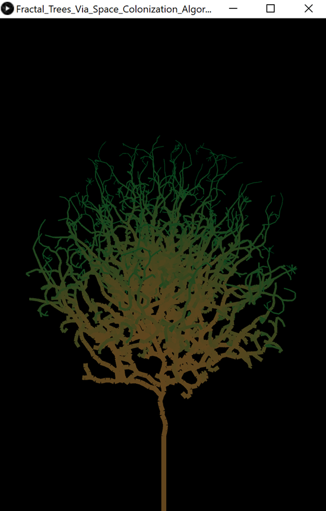
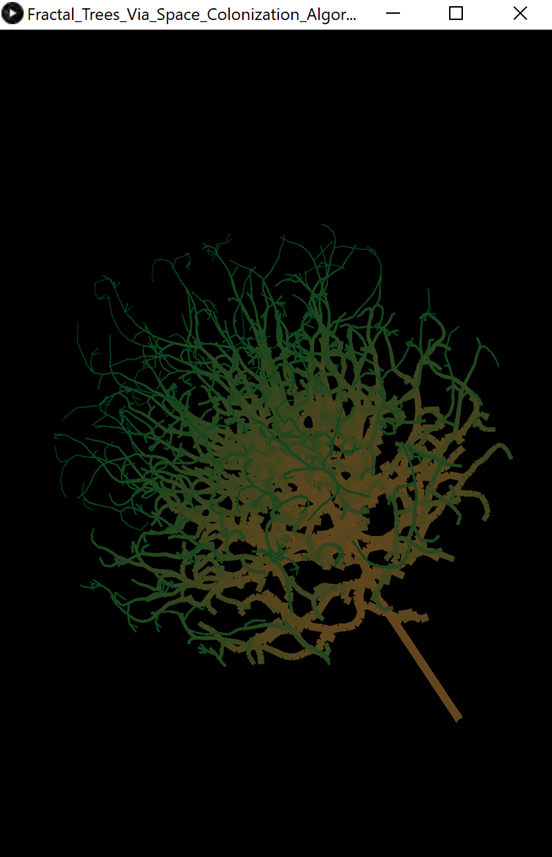

# Fractal Trees Via Space Colonization Algorithm 3D

## Table of Contents
- [Fractal Trees Via Space Colonization Algorithm 3D](#fractal-trees-via-space-colonization-algorithm-3d)
  - [Table of Contents](#table-of-contents)
  - [Description](#description)
      - [Programming language(s):](#programming-languages)
    - [Display](#display)
      - [Examples](#examples)
    - [Folder structure](#folder-structure)
  - [Installation](#installation)
  - [Usage](#usage)
    - [Invokation](#invokation)
    - [Operation](#operation)
  - [Contributions](#contributions)

## Description
This program generates a 3D fractal tree via the space colonization algorithm.  
Start date: November 03, 2020  
Current version: 0.1.0  
#### Programming language(s):
- Processing (Java)
	- [Fractal_Trees_Via_Space_Colonization_Algorithm_3D.pde](Fractal_Trees_Via_Space_Colonization_Algorithm_3D.pde)&mdash;main program entrance sets up canvas and executes animation steps
	- [Branch.pde](Branch.pde)&mdash;defines Branch class/object
	- [Leaf.pde](Leaf.pde)&mdash;defines Leaf class/object
	- [Tree.pde](Tree.pde)&mdash;defines Tree class/object

### Display
#### Examples

### Folder structure
| Tree with Root Having Local Path | Generation Method | Description |
| -------------------------------- | ----------------- | ----------- |
| [https://github.com/anderjef/Fractal_Trees_Via_Space_Colonization_Algorithm_3D](https://github.com/anderjef/Fractal_Trees_Via_Space_Colonization_Algorithm_3D) | auto-generated by Processing | <!-- --> |
| [.github/](.github/) | <!-- --> | holds GitHub-specific documents |

## Installation
- Download [ZIP](https://github.com/anderjef/Fractal_Trees_Via_Space_Colonization_Algorithm_3D/archive/Fractal_Trees_Via_Space_Colonization_Algorithm_3D.zip). Extract to a folder named Fractal_Trees_Via_Space_Colonization_Algorithm_3D.
- Download and install [Processing 3 or compatible](https://processing.org/). Please understand that Processing may have bugs of its own.
- Open any of the Processing Source Code files with the Processing IDE (PDE).
- Install the PeasyCam library (within the Processing environment).

## Usage
### Invokation
- See [Installation](#installation).
- Run the code from within the Processing IDE or export the application first.

### Operation
Click and drag the display to rotate the camera. Scroll to zoom.

## Contributions
- Jeffrey Andersen&mdash;developer
- [YouTube The Coding Train Video 1](https://www.youtube.com/watch?v=kKT0v3qhIQY) and [YouTube The Coding Train Video 2](https://www.youtube.com/watch?v=JcopTKXt8L8)&mdash;inspiration

For copyright, license, and warranty, see [LICENSE.md](LICENSE.md).