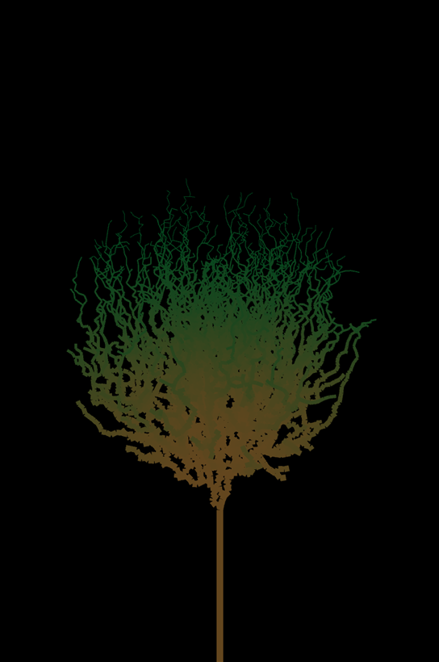
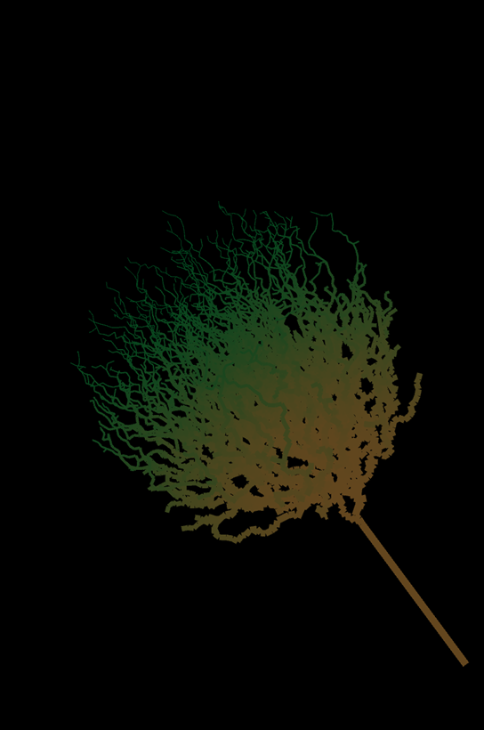

# Fractal Trees Via Space Colonization Algorithm 3D

## Description
This program generates a 3D fractal tree via the space colonization algorithm.  
Start date: November 03, 2020  
Current version: 0.1.0  
#### Programming language(s):
- Processing (Java)
	- [Fractal_Trees_Via_Space_Colonization_Algorithm_3D.pde](Fractal_Trees_Via_Space_Colonization_Algorithm_3D.pde) main program entrance sets up canvas and executes animation steps
	- [Branch.pde](Branch.pde) defines Branch class/object
	- [Leaf.pde](Leaf.pde) defines Leaf class/object
	- [Tree.pde](Tree.pde) defines Tree class/object

### Display
#### Examples

### Folder structure
| Tree with Root Having Local Path | Generation Method | Description |
| -------------------------------- | ----------------- | ----------- |
| [/Fractal_Trees_Via_Space_Colonization_Algorithm_3D](https://github.com/anderjef/Fractal_Trees_Via_Space_Colonization_Algorithm_3D) | auto-generated by Processing | <!-- --> |

## Installation
- Download [ZIP](https://github.com/anderjef/Fractal_Trees_Via_Space_Colonization_Algorithm_3D/archive/Fractal_Trees_Via_Space_Colonization_Algorithm_3D.zip). Extract to a folder named Fractal_Trees_Via_Space_Colonization_Algorithm_3D.
- Download and install [Processing 3](https://processing.org/). Please understand that Processing may have bugs of its own.
- Open any of the Processing Source Code files with the Processing IDE (PDE).
- Install the PeasyCam library.
- Run the code from within the Processing IDE or export the application first.

## Usage
### Invokation
1. Method 1
	- Download the appropriate [ZIP](https://github.com/anderjef/Fractal_Trees_Via_Space_Colonization_Algorithm_3D/archive/Fractal_Trees_Via_Space_Colonization_Algorithm_3D.zip) then invoke the corresponding [executable](#Executables). Unless using 64-bit Windows, install or have installed [Java 8](https://java.com/en/download/).
2. Method 2
	- See [Installation](#Installation).

### Operation
Click and drag the display to rotate the camera. Scroll to zoom.

### Executables
- [32-bit Linux](https://github.com/anderjef/Fractal_Trees_Via_Space_Colonization_Algorithm_3D/application.linux32/Fractal_Trees_Via_Space_Colonization_Algorithm_3D)
- [64-bit Linux](https://github.com/anderjef/Fractal_Trees_Via_Space_Colonization_Algorithm_3D/application.linux64/Fractal_Trees_Via_Space_Colonization_Algorithm_3D)
- [ARM 64-bit Linux](https://github.com/anderjef/Fractal_Trees_Via_Space_Colonization_Algorithm_3D/application.linux-arm64/Fractal_Trees_Via_Space_Colonization_Algorithm_3D)
- [Hard Float ARMv6 Linux](https://github.com/anderjef/Fractal_Trees_Via_Space_Colonization_Algorithm_3D/application.linux-armv6hf/Fractal_Trees_Via_Space_Colonization_Algorithm_3D)
- [32-bit Windows](https://github.com/anderjef/Fractal_Trees_Via_Space_Colonization_Algorithm_3D/application.windows32/Fractal_Trees_Via_Space_Colonization_Algorithm_3D.exe)
- [64-bit Windows](https://github.com/anderjef/Fractal_Trees_Via_Space_Colonization_Algorithm_3D/application.windows64/Fractal_Trees_Via_Space_Colonization_Algorithm_3D.exe)

## Contributions
- Jeffrey Andersen - developer
- [YouTube The Coding Train Video 1](https://www.youtube.com/watch?v=kKT0v3qhIQY) and [YouTube The Coding Train Video 2](https://www.youtube.com/watch?v=JcopTKXt8L8) - inspiration

For copyright, license, and warranty, see [LICENSE.md](https://github.com/anderjef/Fractal_Trees_Via_Space_Colonization_Algorithm_3D/LICENSE.md).